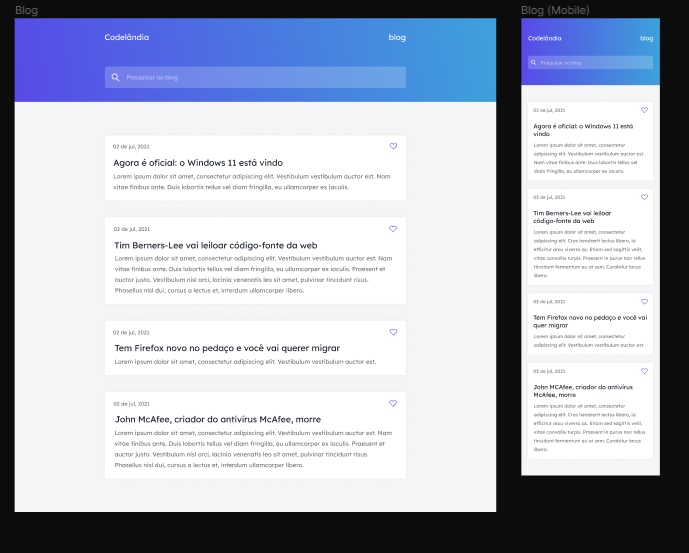

<p align="center">
  
</p>

<h1  align="center">Desafio 01 - Codelândia</h1>

<div style="align:center; justify-content:center; display:flex; flex-direction:row;">
  

       

  
</div>

<h1 align="center">
    
</h1>

<br>

## 🧪 Technologies

This project was developed using the following technologies:

- [HTML5](https://html5.org)
- [CSS3](https://www.w3.org/Style/CSS/Overview.en.html)
- [JavaScript](https://www.javascript.com)

## 🚀 Getting started

Clone the project and access the folder.

```bash
$ git clone https://github.com/JeffyMesquita/Blog.git
$ cd Blog
```

Remember to create your App on the Discord server to get the authentication credentials. Then define your App settings in the .env file (remove the example from the .env.example file).


## 🔖 Layout

You can view the project layout through the links below:

- [Layout](https://www.figma.com/file/Yb9IBH56g7T1hdIyZ3BMNO/Desafios---Codelândia?node-id=0%3A1) 

by [Iuri Silva - iuricode](https://github.com/iuricode)

Remembering that you need to have a [Figma](http://figma.com/) account to access it.

## 📝 License

This project is licensed under the MIT License. See the [LICENSE](LICENSE) file for details.

---

Made with :heartpulse: by [jeffymesquita](...) 👋